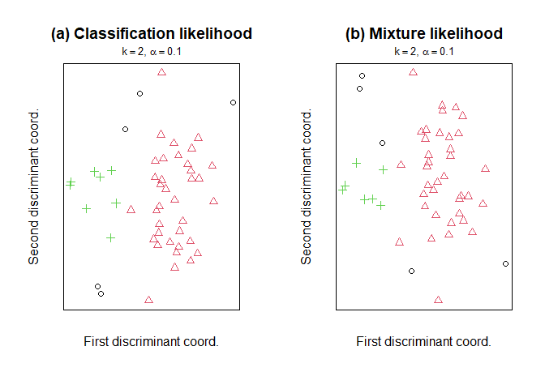

<!-- README.md is generated from README.Rmd. Please edit that file -->

# `robClus`: Robust Trimmed Clustering

The package `robClus` is a development version of extensions to the
TCLUST (method, algorithm and package).

## Installation

The `robClus` package is NOT on CRAN (The Comprehensive R Archive
Network) and the latest release can be installed only from sources.

## Building from source

To install the latest stable development version from GitHub, you can
pull this repository and install it using

    ## install.packages("remotes")
    remotes::install_github("valentint/rrdev", subdir="robClus")

Of course, if you have already installed `remotes`, you can skip the
first line (I have commented it out).

## Example 1: Feasible robust model-based clustering

Outlying data can heavily influence standard clustering methods. At the
same time, clustering principles can be useful when robustifying
statistical procedures. These two reasons motivate the development of
feasible robust model-based clustering approaches. Instead of trying to
“fit” noisy data, a proportion alpha of the most outlying observations
is trimmed. The `robClus` package efficiently handles different cluster
scatter constraints. Graphical exploratory tools are also provided to
help the user make sensible choices for the trimming proportion as well
as the number of clusters to search for.

``` r
library(robClus)
#> Robust Clustering Based on Trimming (version 2.2-0)
data (M5data)
x <- M5data[, 1:2]

clus.a <- tclust2(x, k = 3, alpha = 0.1, restr.fact =  1,
                  restr = "eigen", equal.weights = TRUE)
clus.b <- tclust2(x, k = 3, alpha = 0.1, restr.fact =  1,
                   restr="eigen", equal.weights = FALSE)
clus.c <- tclust2(x, k = 3, alpha = 0.1, restr.fact =  1,
                  restr = "deter", equal.weights = TRUE)
clus.d <- tclust2(x, k = 3, alpha = 0.1, restr.fact = 50,
                  restr = "deter", equal.weights = FALSE)

pa <- par (mfrow = c (2, 2))
plot (clus.a, main = "(a)")
plot (clus.b, main = "(b)")
plot (clus.c, main = "(c)")
plot (clus.d, main = "(d)")
```

<!-- -->

``` r
par (pa)
```

## Example 2: Improved initialization approach

The estimation of trimmed clustering partitions is time consuming,
therefore another issue is the improvement of the computational
procedure. The new function followes an improved initialization
methdology which makes it much faster than the old one. For this example
it will be necessary to instal the old `tclust` package as well as the
`microbenchmark`package.

``` r
## install.packages(c("tclust", "microbenchmark", "mclust")
```

``` r
library(microbenchmark) # for microbenchmark()
library(tclust)         # for tclust()
#> Registered S3 methods overwritten by 'tclust':
#>   method            from   
#>   print.DiscrFact   robClus
#>   plot.DiscrFact    robClus
#>   summary.DiscrFact robClus
#> 
#> Attaching package: 'tclust'
#> The following objects are masked from 'package:robClus':
#> 
#>     DiscrFact, plot.DiscrFact, print.DiscrFact, summary.DiscrFact
library(robClus)        # for tclust2()
library(mclust)         # for adjustedRandIndex()
#> Package 'mclust' version 6.0.0
#> Type 'citation("mclust")' for citing this R package in publications.

data (M5data)
x <- M5data[, 1:2]

## Compare the results of tclust() and tclust2()
c1 <- tclust2(x, k=3, alpha=0.1, restr.fact=50)
c2 <- tclust(x, k=3, alpha=0.1, restr.fact=50)
(adj <- adjustedRandIndex(c1$cluster, c2$cluster))
#> [1] 0.990129

## Compare the computational time of tclust() and tclust2()
microbenchmark(tclust2(x, k=3, alpha=0.1, restr.fact=50),
               tclust(x, k=3, alpha=0.1, restr.fact=50), times=10)
#> Unit: milliseconds
#>                                             expr       min       lq      mean
#>  tclust2(x, k = 3, alpha = 0.1, restr.fact = 50) 1232.0507 1475.247 1579.6065
#>   tclust(x, k = 3, alpha = 0.1, restr.fact = 50)  596.9512  609.099  652.4252
#>     median        uq       max neval
#>  1620.2900 1653.7030 1837.4126    10
#>   633.0378  676.2794  790.1714    10
```

## Example 3: Parallel computing

Further improvement of the computational time, especially in case of
large data sets can be achieved by parallel omputing which is
implemented in the new `tclust()` function.

``` r
library(doParallel)     # for detectCores()
#> Loading required package: foreach
#> Loading required package: iterators
#> Loading required package: parallel
library(robClus)        # for tclust2()

p <- 100
ni <- c(3600, 5400, 1000)
sigma <- diag(p)
center <- rep(1, p)
x <- rbind(MASS::mvrnorm(ni[1], center * 0,   sigma),
           MASS::mvrnorm(ni[2], center * 5,   sigma*6),
           MASS::mvrnorm(ni[3], center * 2.5, sigma*50))

## How many cores do you have?
(ncores <- detectCores())
#> [1] 12

(ptime_par <- system.time({c1 <- tclust2(x, k=3, alpha=0.1, restr.fact=50, parallel=TRUE)})[3])
#> elapsed 
#>  448.02
(ptime_seq <- system.time({c2 <- tclust2(x, k=3, alpha=0.1, restr.fact=50, parallel=FALSE)})[3])
#> elapsed 
#>  714.02
```

On my laptop with 12 cores and p=100 the parallel version is more than
twice faster.

Please note, that if you repeat the example with, say, p=2, the parallel
version will be much slower.

## Example 4: Mixture modelling

To illustrate the option for mixture modeling in the new `tclust()`
function we will consider the well-known Fisher IRIS data set and as in
McLachlan and Peel (2000) will try to model only the “virginica” class.
The mixture modelling option is selected by setting `opt="MIXT"`
(alternative to `opt="HARD"` which is the default).

``` r
library(robClus)        # for tclust2()
library(mclust)         # for adjustedRandIndex()    

x <- iris[iris[,5]=="virginica", 1:4]
c1 <- tclust2(x, k=2, alpha=0.1, nstart=1000, opt="HARD")
c2 <- tclust2(x, k=2, alpha=0.1, nstart=1000, opt="MIXT")

(adj1 <- adjustedRandIndex(c1$cluster, c2$cluster))
#> [1] 0.9125094

pa <- par (mfrow = c (1, 2))
plot (c1, main = "(a) Classification likelihood")
plot (c2, main = "(b) Mixture likelihood")
```

<!-- -->

``` r
par (pa)
```
