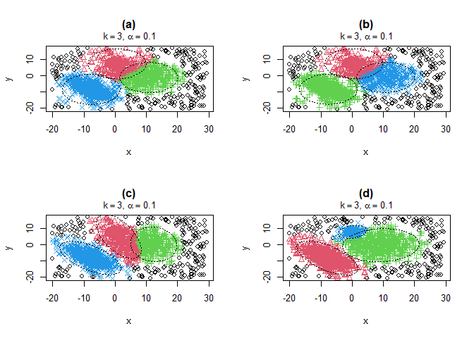

<!-- README.md is generated from README.Rmd. Please edit that file -->

# `robClus`: Robust Trimmed Clustering

The package `robClus` is a development version of extensions to the
TCLUST (methid, algorithm and package).

## Installation

The `robClus` package is NOT on CRAN (The Comprehensive R Archive
Network) and the latest release can be installed only from sources.

## Building from source

To install the latest stable development version from GitHub, you can
pull this repository and install it using

    ## install.packages("remotes")
    remotes::install_github("valentint/rrdev", subdir="robClus"

Of course, if you have already installed `remotes`, you can skip the
first line (I have commented it out).

## Example

Outlying data can heavily influence standard clustering methods. At the
same time, clustering principles can be useful when robustifying
statistical procedures. These two reasons motivate the development of
feasible robust model-based clustering approaches. Instead of trying to
“fit” noisy data, a proportion α of the most outlying observations is
trimmed. The `robClus` package efficiently handles different cluster
scatter constraints. Graphical exploratory tools are also provided to
help the user make sensible choices for the trimming proportion as well
as the number of clusters to search for.

``` r
library(robClus)
#> Robust Clustering Based on Trimming (version 2.0-1)
data (M5data)
x <- M5data[, 1:2]

clus.a <- tclust2(x, k = 3, alpha = 0.1, restr.fact =  1,
                  restr = "eigen", equal.weights = TRUE)
clus.b <- tclust2(x, k = 3, alpha = 0.1, restr.fact =  1,
                   equal.weights = TRUE)
clus.c <- tclust2(x, k = 3, alpha = 0.1, restr.fact =  1,
                  restr = "deter", equal.weights = TRUE)
clus.d <- tclust2(x, k = 3, alpha = 0.1, restr.fact = 50,
                  restr = "eigen", equal.weights = FALSE)

pa <- par (mfrow = c (2, 2))
plot (clus.a, main = "(a) tkmeans")
plot (clus.b, main = "(b) Gallegos and Ritter")
plot (clus.c, main = "(c) Gallegos")
plot (clus.d, main = "(d) tclust")
```

<!-- -->

``` r
par (pa)
```
